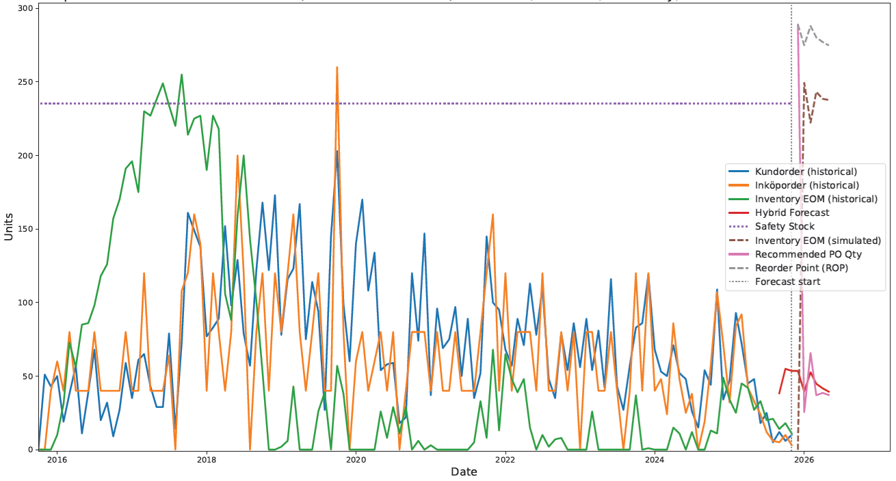

# DemandForecast: Intelligent Inventory Demand Forecasting (XGBoost + Croston + Hybrid + MLOps)  

A full end-to-end supply chain forecasting system engineered for real-world ERP data.
Includes hybrid intermittent-demand forecasting, inventory simulation, safety stock & reorder point optimization, and a complete MLOps pipeline (CI/CD, Docker, MLflow, nightly retraining, drift gating).

---

# Overview

This repository contains a production-grade demand forecasting system originally developed for a real manufacturing & supply-chain setting:
- Forecast demand for purchased & resold components
- Handle intermittent / lumpy demand
- Correct for stock-outs using inventory simulation
- Use hybrid models: XGBoost + Croston SBA (with automatic weighting)
- Compute safety stock & reorder point
- Simulate future inventory levels
- Recommend future purchase quantities
- Track model performance over time
- Automatically retrain daily

This is not a toy example — it reflects a true implementation used for ERP-driven procurement.

---

# Example

<p align="center"></p>
<p align="center"><i>Figure: Demand forecast using hybrid model.</i></p>

# Architecture Overview
```scss
 ┌───────────────────┐
 │   Raw ERP Data    │  (Purchase Orders, Sales Orders)
 └─────────┬─────────┘
           │
           ▼
 ┌──────────────────────────┐
 │ Demand Rebuilder         │  ← fixes stockout bias
 │ inv_df (true_demand_est) │
 └─────────┬────────────────┘
           │
           ▼
 ┌─────────────────────────────────────┐
 │ Hybrid Forecast (XGB + Croston)     │
 │  - intermittency detection (ADI,CV²)│
 │  - automatic model weighting        │
 └─────────┬───────────────────────────┘
           │
           ▼
 ┌────────────────────────────────────┐
 │ Safety Stock + Reorder Point       │
 │  - service level Z                 │
 │  - lead time variances             │
 └─────────┬──────────────────────────┘
           │
           ▼
 ┌────────────────────┐
 │ Inventory Simulator│
 │ sim_df (ROP-ready) │
 └─────────┬──────────┘
           │
           ▼
 ┌────────────────────┐
 │    MLflow Registry │
 │    Artifacts + UI  │
 └────────────────────┘
```

# Features

### **Forecasting**
- XGBoost regression with rich time-series features
- Croston SBA for intermittent demand
- Hybrid weighting based on product classification
- Drift detection & automatic quality gating
- Multi-step forecasting (horizon configurable)

### **Inventory Optimization**
- Stockout-adjusted historical demand
- Safety Stock using variability in demand & lead time
- Reorder point (ROP) simulation
- Future inventory projections
- Purchase recommendations

### **MLOps**
- Full CI/CD pipeline
- Nightly automatic retraining
- MLflow experiment tracking + model registry
- Dockerized pipeline
- Notebook execution tests
- Code linting (flake8) + formatting (black)
- Unit tests for forecasting & inventory logic
- Drift gating (pipeline fails if model worsens)

---

# Repository Structure

```powershell
demandforecast/
│
├── src/
│   ├── forecasting/
│   │    ├── xgb_model.py
│   │    ├── croston.py
│   │    ├── hybrid_forecast.py
│   │
│   ├── inventory/
│   │    ├── demand_reconstruction.py
│   │    ├── safety_stock.py
│   │    ├── inventory_simulation.py
│   │
│   ├── mlops/
│   │    ├── train_pipeline.py
│   │    ├── persist.py
│   │    ├── evaluate.py
│   │    ├── mlflow_utils.py
│   │
│   ├── utils/
│   │    ├── metrics.py
│   │    ├── plots.py
│   │
│   ├── data_loader.py
│   └── cli.py
│
├── notebooks/
│   ├── 01_data_exploration.ipynb
│   ├── 02_demand_reconstruction.ipynb
│   ├── 03_feature_engineering_and_xgb.ipynb
│   ├── 04_croston_and_hybrid.ipynb
│   ├── 05_inventory_simulation_and_rop.ipynb
│   └── 06_full_pipeline_demo.ipynb
│
├── data/
│   ├── README.md
│   ├── sample_sales.csv
│   ├── sample_purchase.csv
│
├── artifacts/        # model outputs (ignored)
├── mlruns/           # MLflow runs (ignored)
├── tests/
│   ├── test_xgb.py
│   ├── test_croston.py
│   └── test_inventory.py
├── Dockerfile
├── requirements.txt
├── README.md
└── .github/
    ├── workflows/
    │     ├── ci.yml
    │     ├── docker.yml
    │     └── mlops.yml
```

---

# End-To-End Pipeline

The heart of the system lives here:
```bash
src/mlops/train_pipeline.py
```

Once per night, this job:
- Loads latest historical data
- Reconstructs true demand (fixes stockouts)
- Classifies demand intermittency (ADI, CV²)
- Fits hybrid model (XGB + Croston)
- Runs drift detection
- Computes safety stock
- Simulates future inventory & ROP
- Registers model in MLflow Registry
- Uploads artifacts (forecast, model, metrics)
- Updates baseline for tomorrow

---

# Testing

Run all tests:
```bash
pytest -q
```

CI ensures:
- model code is correct
- notebooks execute end-to-end
- inventory logic is accurate
- Croston/XGB/hybrid behave correctly
- no regressions

---

# Docker Support
Build image:
```bash
docker build -t demandforecast .
```

Run pipeline:
```bash
docker run demandforecast
```


Image published nightly to GHCR:
```bash
ghcr.io/dhanysaputra/demandforecast:nightly
```

---

# MLflow Tracking & Model Registry

MLflow stores:
- runs
- metrics
- forecasts
- safety stock
- model.pkl
- model versions
- Start the UI locally:
- mlflow ui --port 5000

---

# Forecasting Algorithms
XGBoost (with feature engineering)
- lags
- rolling window statistics
- trend features
- seasonality extraction
- horizon-iterative prediction

Croston SBA
Ideal for products with Zero-demand months.

Hybrid Model
Automatically picks weighting:
```bash
if intermittent:
    w = 0.2 (XGB), 0.8 (Croston)
else:
    w = 0.8 (XGB), 0.2 (Croston)
```

---

# Safety Stock & Reorder Point

The system supports:
- operational safety stock
- variable lead time
- lead time distribution
- demand variability
- reorder point simulation
- purchase recommendations

---

# MLOps Nightly Retraining

GitHub Actions (mlops.yml) runs at 02:15 UTC daily:
- full retrain
- drift detection
- model versioning (MLflow registry)
- artifact upload
- optional Docker nightly build

